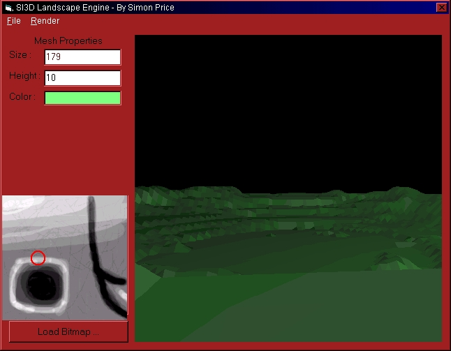



## DIRECT3D LANDSCAPE GENERATOR

### Description

This makes a 3D landscape with bitmaps. You need DirectX7 to run this. Please note that I have 2 accounts with PSC, both in the name of Simon Price, so to see my other submissions, do a search for my name.
 
### More Info
 

             |
---                |---
**Submitted On**   |2000-09-17 16:23:14
**By**             |[Simon Price](https://github.com/Planet-Source-Code/PSCIndex/blob/master/ByAuthor/simon-price.md)
**Level**          |Intermediate
**User Rating**    |4.8 (277 globes from 58 users)
**Compatibility**  |VB 6\.0
**Category**       |[Graphics](https://github.com/Planet-Source-Code/PSCIndex/blob/master/ByCategory/graphics__1-46.md)
**World**          |[Visual Basic](https://github.com/Planet-Source-Code/PSCIndex/blob/master/ByWorld/visual-basic.md)
**Archive File**   |[CODE\_UPLOAD99369172000\.zip](https://github.com/Planet-Source-Code/simon-price-direct3d-landscape-generator__1-11512/archive/master.zip)

